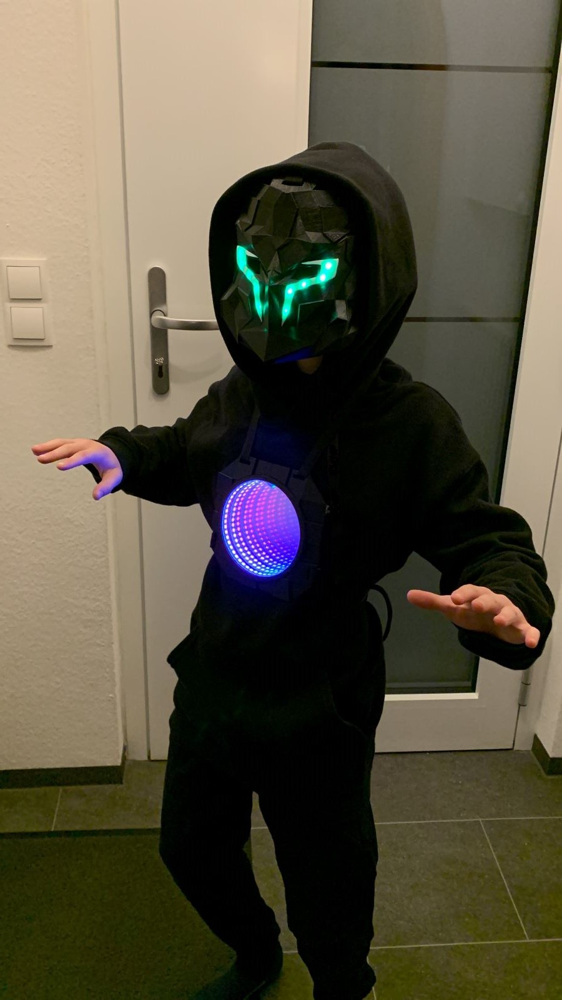
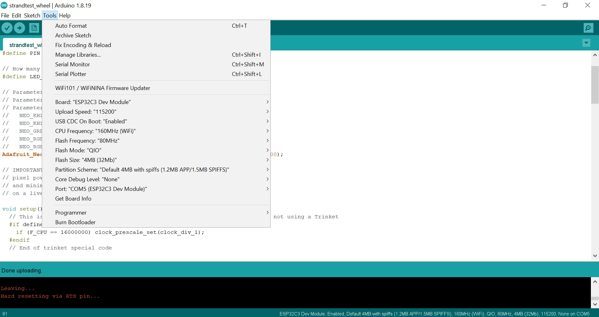

# Reason for this fork (iwegner)
I wanted to add more details than originally provided by 01Spsce. 
Information was collected while bringing the board to life. 
Then I wanted to add a program which controls an external strip of WS2812b LEDs connected to the board.
This stip is an electrical component in a future hero costume for carnival which my son wanted. 
See further docu on this here: [external_led_strip_support docu](external_led_strip_support/README.md).

# ESP32-C3FH4-RGB 

# Driver

https://zadig.akeo.ie/

# Specs from BG website

## What is C3FH4 RGB? 

C3FH4 RGB features an ultra-compact design with one risc-v 32-bit single core processor at 160MHz on a PCB, built-in 400 KB SRAM and 4 MB Flash , integrated with 2.4 GHz Wi Fi and supporting long-distance Bluetooth 5 (LE), with industry-leading RF performance and low power consumption.By combining RSA-3072-based secure boot and the AES-128-XTS-based flash encryption, offers a more secure way to answer the Bluetooth security concerns.
With low power consumption: It is ideal for any space-constrained or battery-powered devices such as wearables, medical devices, sensors, and other IoT devices.and fully compatible with Arduin, MicroPython, ESP32-IDF, and other mainstream development platforms to quickly build various applications.
HIGH INTEGRATION: C3FH4 RGB Including 2 channels of 5V - > 3.3V DC / DC, GPIOx11, programmable RGB light x25, button x2, finely tuned RF circuit, providing stable and reliable wireless communication. 

## Features:

ESP32-C3FH4 (2.4GHz Wi-Fi and supporting long-distance Bluetooth 5 (LE))
built-in 400 KB SRAM and 4 MB Flash
USB Type-C(USB OnThe-Go (OTG))
Including 2 channels of 5V - > 3.3V DC / DC
Integrated 5X5 ws2812b-1515(GPIO8) and 2 buttons(GPIO9 and CHIP_EN)
3V power LED and status LED(GPIO10)
Ceramic Antenna

## Size & Weight:
 
Size: 21 x 18 mm
Weight: 2.3g

## Documentation on chip:
https://www.espressif.com/sites/default/files/documentation/esp32-c3_datasheet_en.pdf

## Package includes:
1 x LED 

# General Flashing Instructions:
* Install driver with zadig as mentioned above.
* Install Arduino IDE and install espressif resources by adding line 
"https://raw.githubusercontent.com/espressif/arduino-esp32/gh-pages/package_esp32_dev_index.json"
to Additional Boards Manager URLs in Arduino IDE Files / Preferences.
* Via Arduino IDE Tools/Board / Board Manager search for ESP32 and choose Espressif Systems version 2.0.2 to install it.
* Install ESP32 Digital RGB LED Drivers and Adafruit NeoPixel via option tools / Manage Libraries in Arduino IDE.
* Setup connection to connect to Board ESP32C3 Dev and com port which is assocuiated to USB Serial Device, not jtag (see Device Manager on Win10). 

Other settings see [IDE settings](resources/settings.jpg)

# Upload sketch from Arduino IDE:

Hold down B button on board, press R button and release again but keep on pressing B, trigger Arduino IDE to upload sketch, keep B pressed until Arduino IDE says that it's connected. Then you can release B button.

Serial works with "CDC enable on boot" set to true.

# Folder structure

* BLE_write
Hello World for bluetooth low energy

* BlinkWithoutDelay
Turns on and off the internal LED without using the delay() function.

* driver
Contains images for driver installation.

* external_led_strip_support
Conecting an external WS2812 strip to the board to light up a costume.

* resources
Images, surfaces and video for the external_led_strip_support project

* RGBWstrandtest
Demo of on-board leds. Changelog iwegner: I had to change RGBWstrandtest.ino to not choose NEO_GRBW for intitialization of strip / led matrix and instead initialize with NEO_GRB. SPecs of the WS2812b in spec of board also mention only RGB but no white sub-led. With this modification the code runs just like the code that the board was shipped with.
BTW: the youtube video referenced by the comments on BG site shows the misalignment of LED color when using original code.

* Schematic
pdf with details of the board

* SimpleWifiTest
Code based on the "HelloServer" code from the ESP32 Arduino Wifi examples, with some NeoPixels mixed in.

* strandtest_wheel.ino:
Color wheel demo of the on-board leds.
Changelog iwegner: After applying the modifications from RGBWstrandtest and some alignment of the setPixelColor() calls, the colors of the leds also look as expected.

* thinger.io
Thinger.io example for the board.

* WiFi.softAP
Simple example for WiFi softAP usage.

# Other branches

fivebyfive-by Andy piper
https://github.com/andypiper/fivebyfive

wordle-device-Ciro Cattuto
https://github.com/ccattuto/wordle-device

# esp32c3-bling Series' Articles

https://dev.to/andypiper/series/16659

https://bigl.es/friday-fun-micro-weather-station/

# Open Source / Contributors

Andy piper (for fivebyfive),

biglesp (Micro Weather Station),

Ciro Cattuto (for wordle-device),

Geek Mom Projects([Sites Using React](https://twitter.com/GeekMomProjects/status/1479210241807900676)  ),

iwegner (for howto fine-tuning and [external_led_strip_support docu](external_led_strip_support/README.md)  ),

And many many others who haven't been mentioned....

# Community

We have both a Discord Server 
https://discord.gg/qMDNZbX9rE

# Contact 01Space
facebook:Jiale Xu
twitter:yongxiangxu251
E-mail：759315223@qq.com
