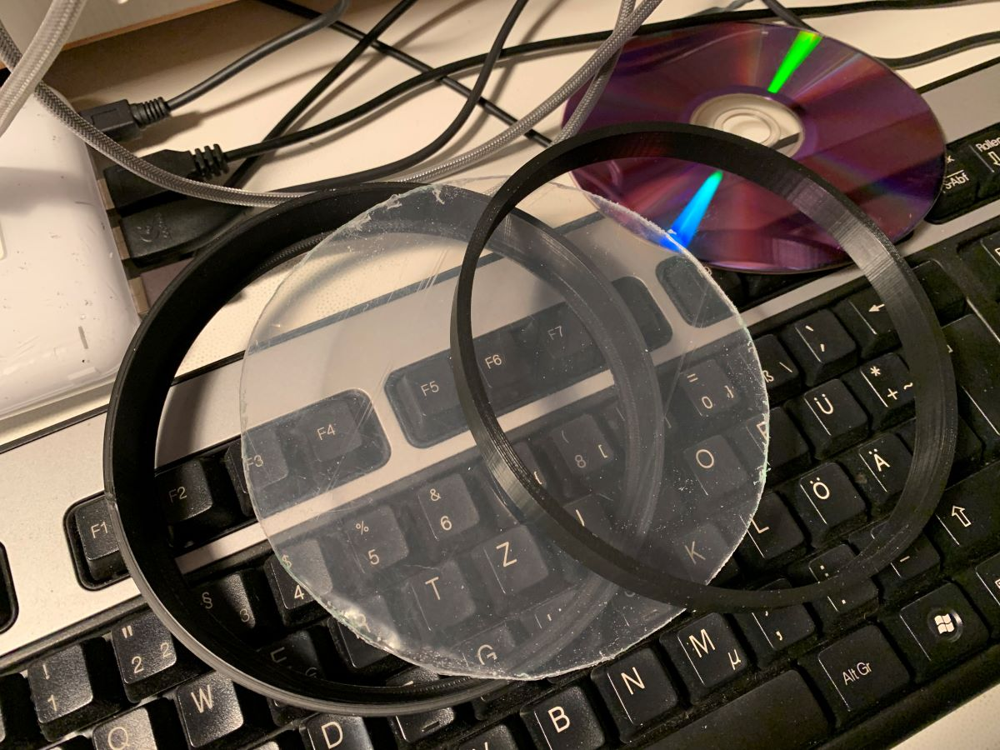
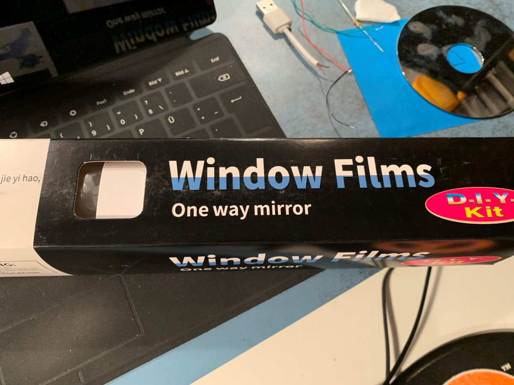
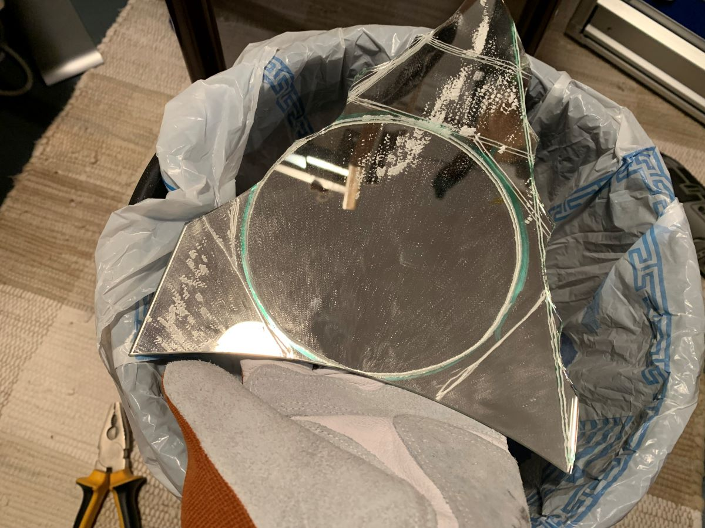
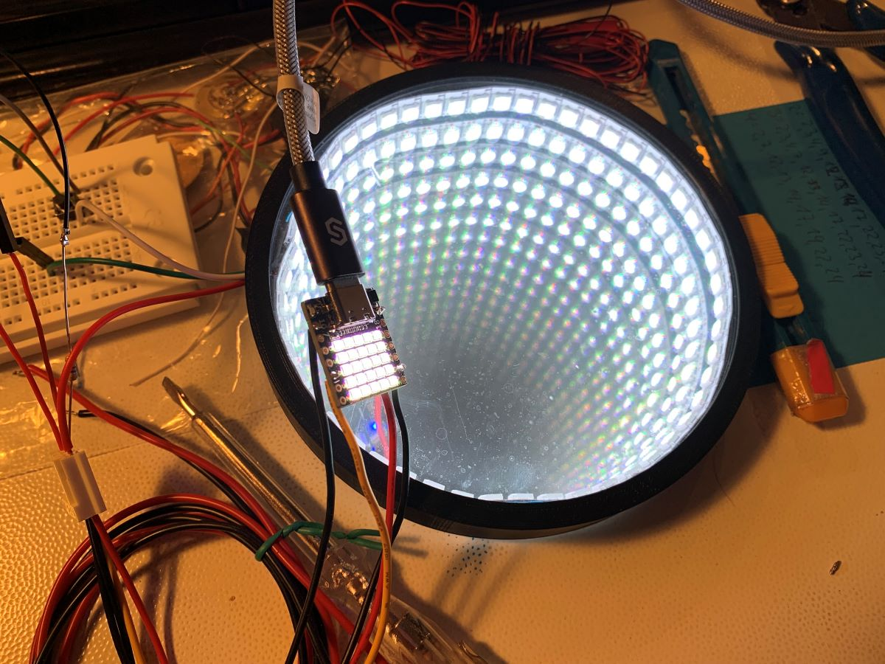
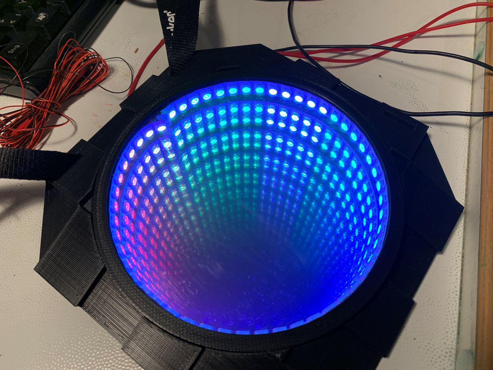

# External LED Strip Support for ESP32C3

My son was asking for some help on a carnival costume. He wanted to build a future hero amor an I proposed LEDs for some effects. In thge past he has build masks out of foam and cardboard. This time we wanted to use the 3D printer so see how it performs on this. 

The costme consists of a corslet and a helmet. For the corslet he chose to have a infinite mirror design which gives a fantastic futuristic look. It looks like you could grab into the chest to change batteries or so ;)
For the helmet he chose to go with a poligonal design including LEDs to pick up the theme from the corslet.
The following shows the steps we did along with the code for the ESP32C3 we used as LED controller.

## Corslet / infinite mirror
The mirror consists of the following layers (from outer to inner):

* 3D printed cover

* Transparent hobby glass

* A one way mirror foil

* 3D printed spacer

* Glas mirror cut out from some old mirror

The corslet holding the infinite mirrow consists of a 3D printed housing which also hides the ESP32C3, a ON/OFF switch and a button to switch LED animation modes.

## Helmet

