# External LED Strip Support for ESP32C3

My son was asking for some help on a carnival costume. He wanted to build a future hero amor an I proposed LEDs for some effects. In thge past he has build masks out of foam and cardboard. This time we wanted to use the 3D printer so see how it performs on this. 

We started with a small ESP32C3 as the board needed to be very light weight. The internal WS2812b leds were helping in the beginning to be sure the code works. Once we switched over to the external led strip the board leds werenÄt used any longer. We thought about attaching the board to the corslet so it still remains visible, but due to time constraints this was canceled. 

The costume consists of a corslet and a helmet. For the corslet he chose to have a infinite mirror design which gives a fantastic futuristic look. It looks like you could grab into the chest to change batteries or so ;)
For the helmet he chose to go with a poligonal design including LEDs to pick up the theme from the corslet.
The following shows the steps we did along with the code for the ESP32C3 we used as LED controller.

## Corslet / Infinite Mirror
The mirror consists of the following layers (from outer to inner):

* 3D printed cover. See [here](../resources/stl/ring_outer.stl) for STL.

* Transparent hobby glass (the image below still shows it still with the protection film on)

* A one way mirror film

* 3D printed spacer. See [here](../resources/stl/ring_inner.stl) for STL.

* A strip of WS2812b LEDs attached to the inside of the spacer (see above).

* Glas mirror cut out from some old mirror. See image below on how we prepared the glass to break at desired locations. Be very careful here! Always wear eye and hand protection!

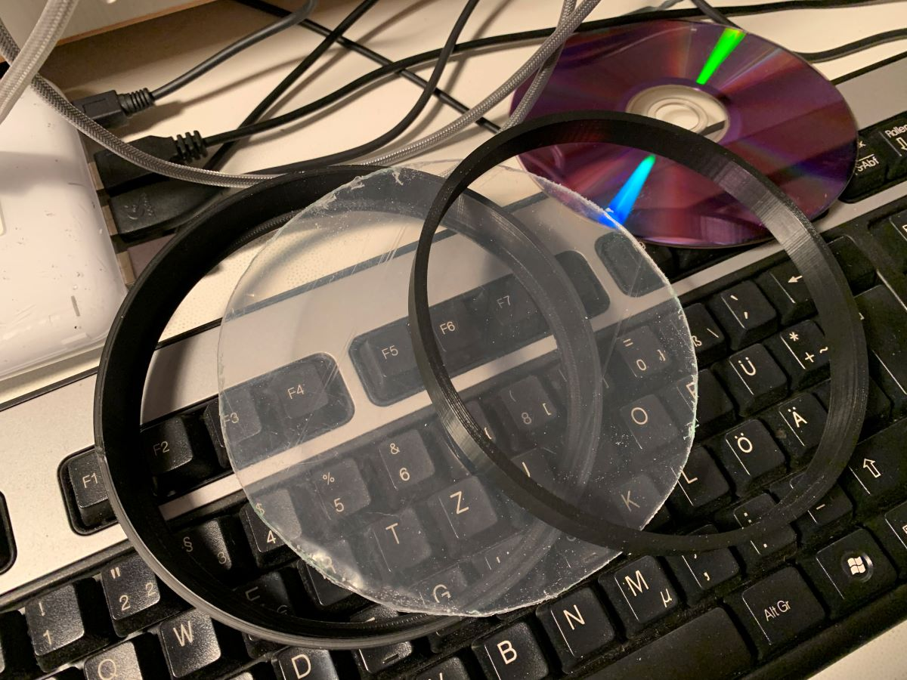
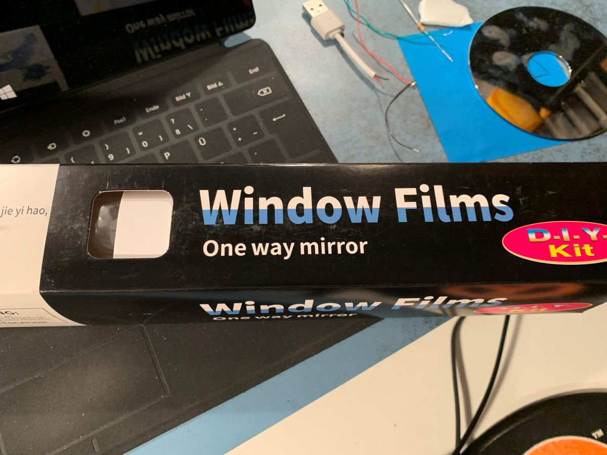
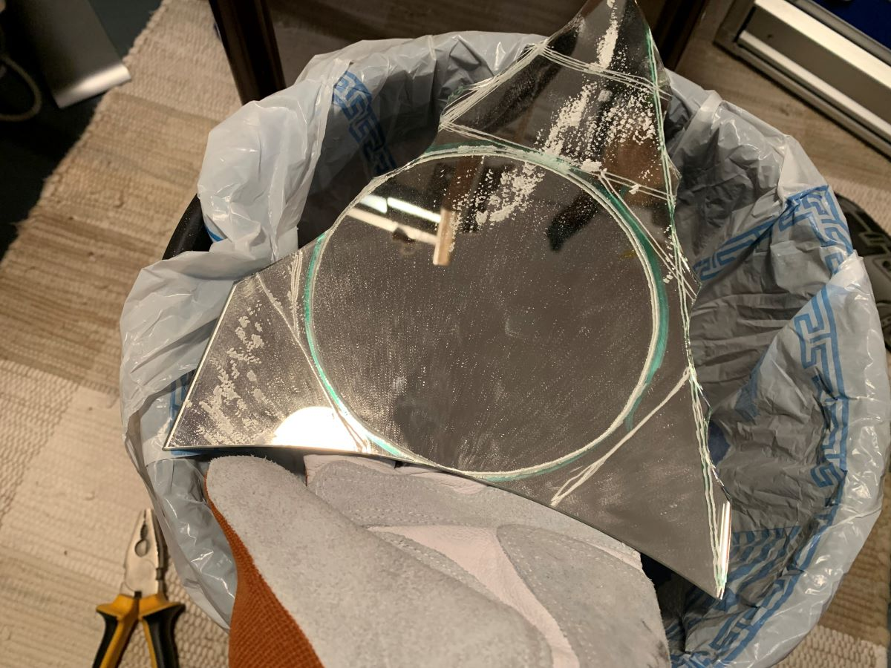

The result then is a circular infinite mirror. We drilled a hole through the 3D prints to lead the wired of the WS2812b LED strip out of the inside of the infinite mirror (see left side of the mirror in the image below).

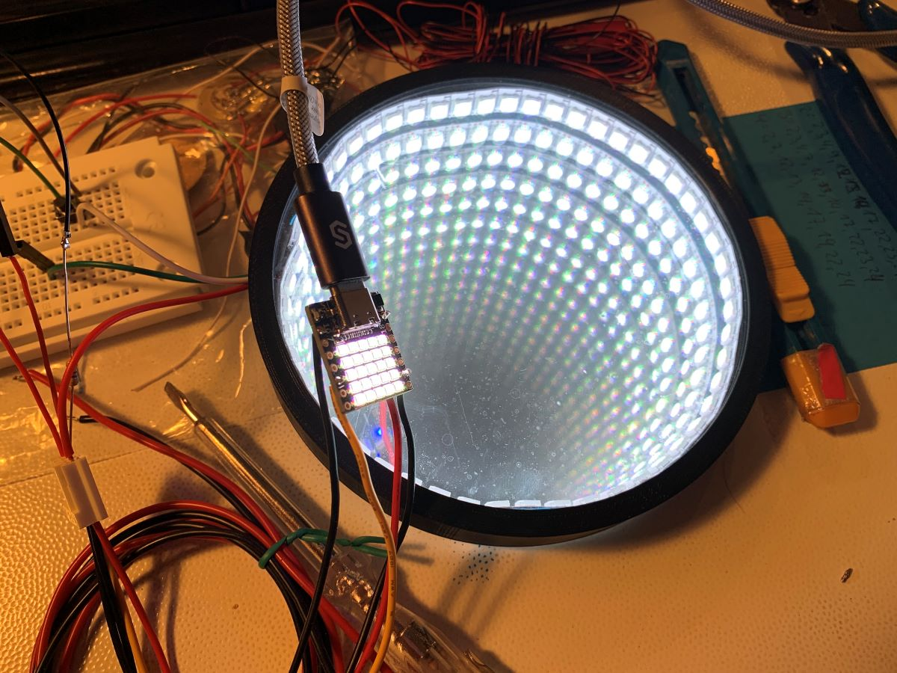

The corslet holding the infinite mirrow consists of a 3D printed housing which also hides the ESP32C3, an ON/OFF switch, and a button to switch through the LED animation modes. It also provides holes to attach a belt so it can be taken off easily.
[STL of the corslet](../resources/stl/corslet.stl)

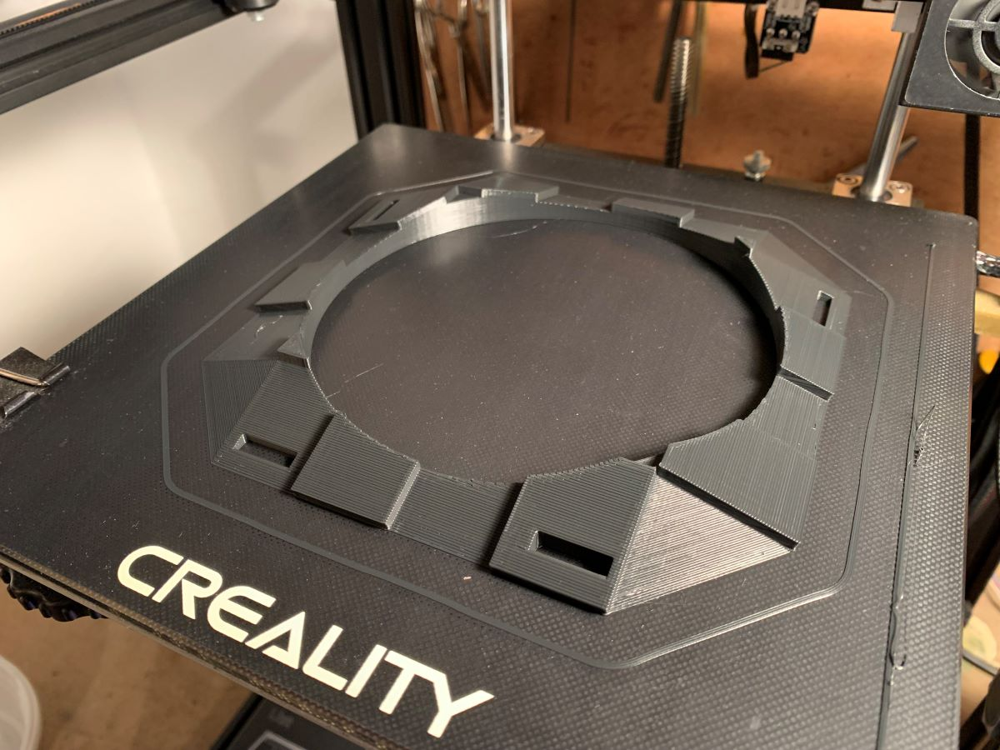
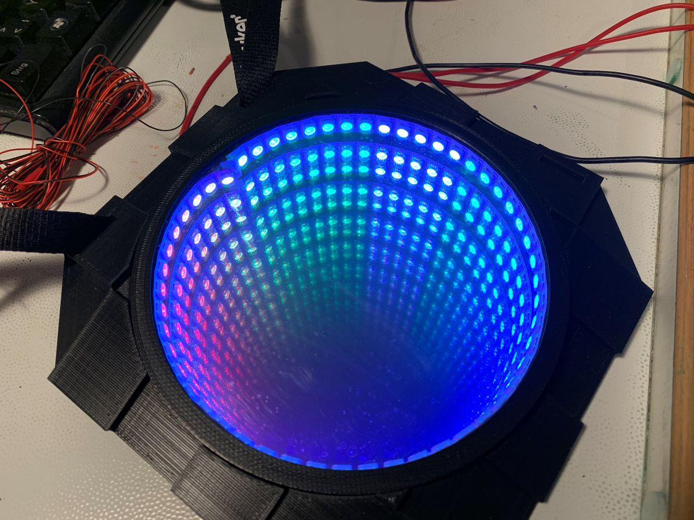
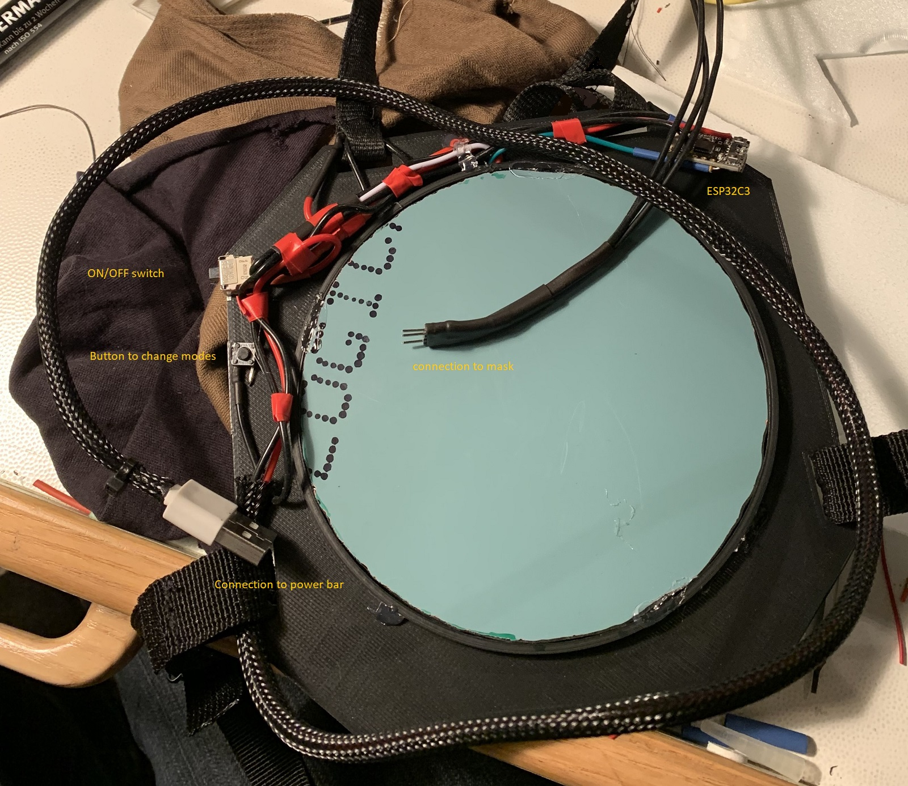

## Helmet / Mask
My son designed the helmet using [Blender](https://www.blender.org).

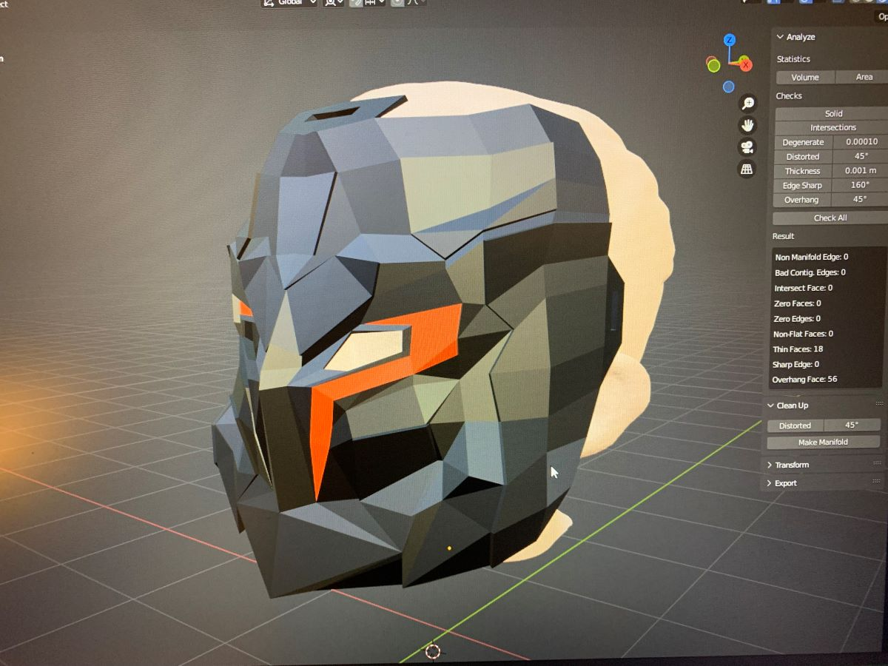

On e.g. Youtube you will find lots of tutorials on how to design your own mask using a mirror technique where you only need to design one side of the mask and it will be automatically be mirrored to the other side.
He used a 3D scan of his head that we captured once using an iPhone XR and some frontal and side 2D images from his face. It took quite some time but we were lucky that we only had to print out the stl one time! Using low speed to enhance quality it took 28h!

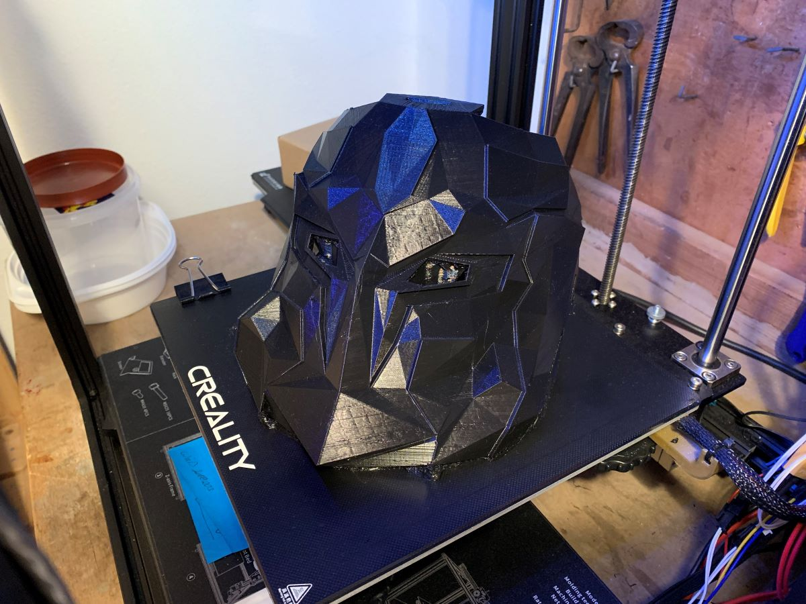

We used white 4mm Depron foam I had lying around to create a good contrast for the eyes. 
We also tried using a 3D print for this but this one didn't carry the LEDs good enough so we switched back to foam. Also, the foam is better to diffuse the LED light.

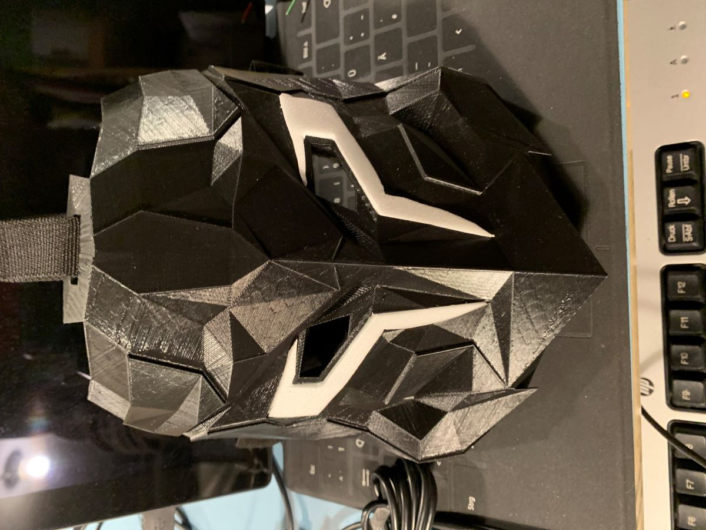

See the following image on how we assembled some LEDs inside of the eyes / eyebrows. To also hide the real eyes behind the mask, we glued some black stocking cloth using hot glue in the inside of the mask.

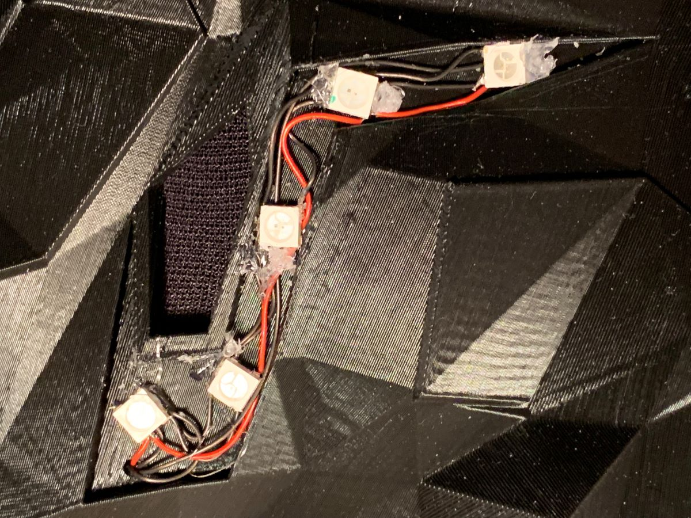

Final result of the mask featuring the LEDs:

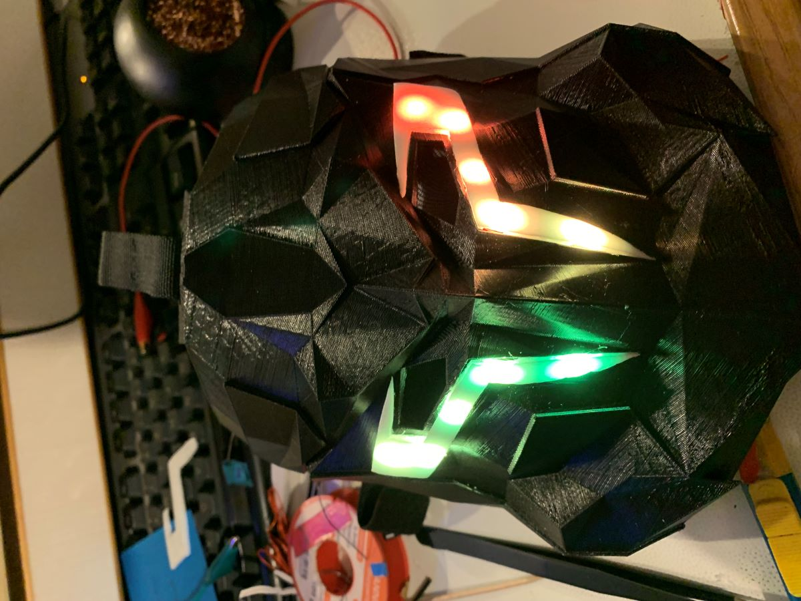

[STL of the mask](../resources/stl/mask.stl) 

We then electrically attached the mask to the corslet, added some cushioning into the mask, and attached belts to both so they can be easily put on and off. A regular 5V powerbar was good enough to power up the leds without getting warm.

## Programming ESP32C3
Next was the ESP32C3 program itself. We had some requirements for different modes but had fun testing a lot as well. See documentation in the [code](external_led_strip_support.ino).

Here is a video showing the different illumination modes:

<video width="320" height="240" controls>
  <source src="https://github.com/iwegner/ESP32-C3FH4-RGB/blob/main/resources/video/IMG_4817.mov" type="video/mp4">
</video>

## Wall Hook
The entire gear can be hung up on a wall using the [wall hook 3d print](../resources/stl/wall_hook.stl).

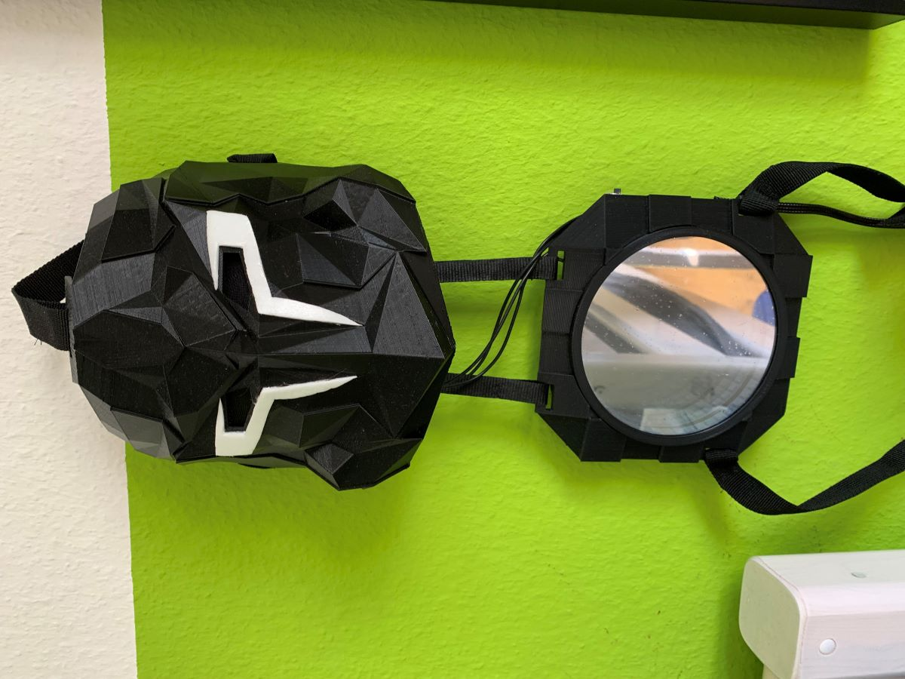